  

  
  
  
  

**Now:** SDE at Heartland Community Network, building a React/TypeScript and FastAPI campaign platform and an LLM campaign planner for Adtua, an out-of-home ad marketplace 
**Before:** 2 years at Sify Technologies, building Java/Spring Boot services and AngularJS dashboards for 10,000+ production network devices 
**Education:** MS Computer Science, Indiana University (GPA 3.93) 
**Open to:** Software Engineer, AI Engineer, and Forward Deployed Engineer roles · San Jose, CA

### Featured projects

<table>
<tr>
<td width="50%" valign="top">

**[Warden](https://github.com/harishsureshdev/github-triage-agent)** 
LLM agent that triages GitHub issues. Its policy is enforced in code, not the prompt, and a 40-scenario eval gates every push.

  
Python · Gemini API · OpenTelemetry · GitHub Actions

</td>
<td width="50%" valign="top">

**[Home Credit Default Analysis](https://github.com/harishsureshdev/home-credit-default-analysis)** 
Loan default prediction on a 7-table Kaggle dataset, comparing logistic regression, random forest, and a PyTorch network.

  
Python · PyTorch · scikit-learn · pandas

</td>
</tr>
<tr>
<td width="50%" valign="top">

**SnapSend** 
File sharing with JWT auth and expiring links. Multipart uploads go straight from the browser to S3, never through the server.

  
Java · Spring Boot · PostgreSQL · Redis · React · AWS

</td>
<td width="50%" valign="top">

**[ReadEase](https://github.com/harishsureshdev/ReadEase)** 
OCR-to-audio web app. Image processing runs as async jobs on a queue so uploads never block the UI.

  
React · Node.js · MongoDB · Tesseract.js

</td>
</tr>
</table>

### Tools

  

Also: LangChain · Qdrant · Neo4j · OpenTelemetry · Gemini API

